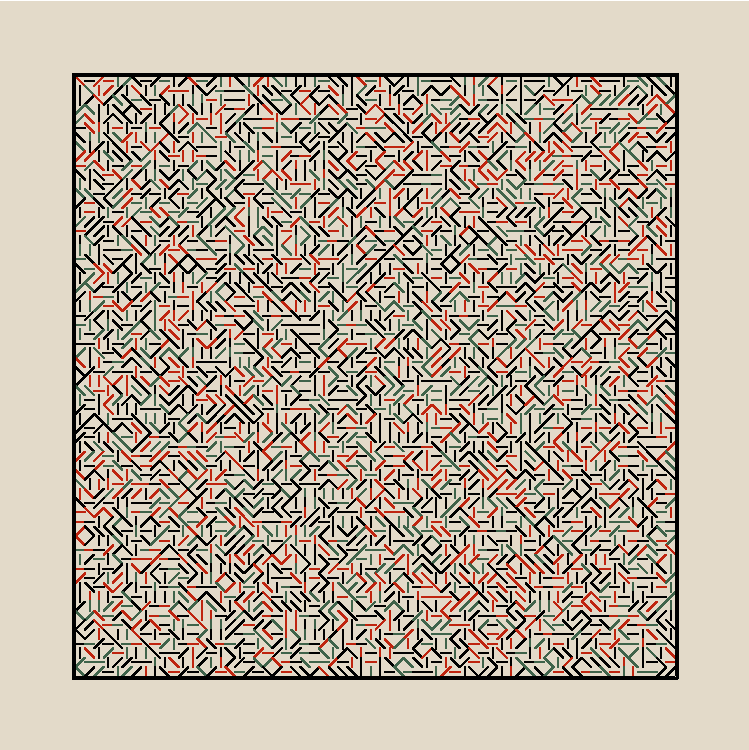

# Tiling

Python practice with Python's Turtle.

Features:

* Vertical lines
* Horizontal lines
* Diagonal lines
* Pen width difference
* Pen colour
* Background colour
* Frame

# Results

<h2>Original
 

 

 